## Go Blog
---
### Description

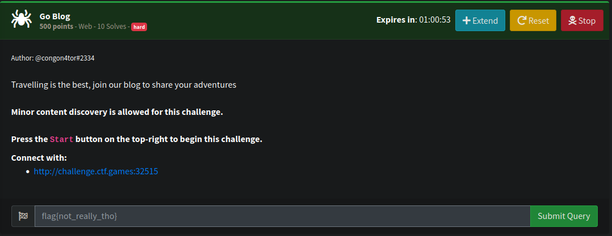

Given a web application with features that we can posting some articles. There's also a feature to change username.

Based on the title I assume this application written with Golang

based on description, it seems we need enumerate file and directory to find something

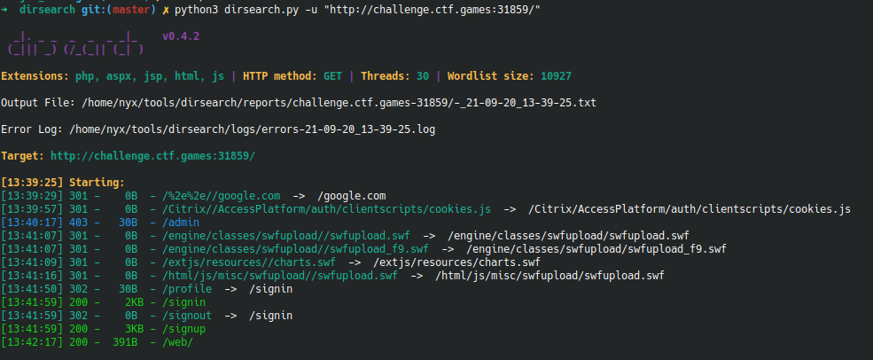

We got `admin/` and `/web/` directory

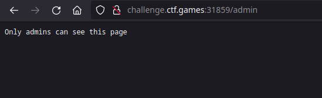

based on the response, i think we need to gaining a privilege escalation to admin.

Let's check `/web`

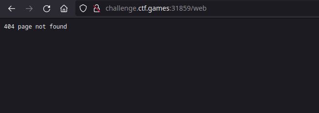

We got a http 404 code, even though dirsearch said it 200

and then, I realize i missed `/` in suffix and we got front-end template source code.

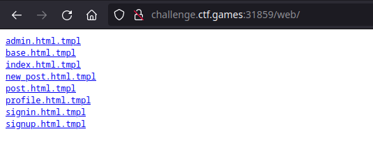

After I realize it. I run `wfuzz` and add `/` in suffix to make sure i dont miss anything important

([/web/](web/))

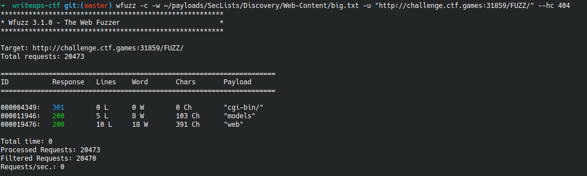

phew, apparently I really missed something important.

We got a `models` for this application.

([/models/](models/))

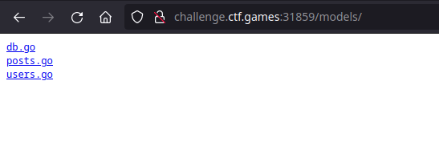

Since we need to get admin user my first thought it was using XSS. So, I create a post and put generic XSS payload.

But, we didn't get anything. So, I assume it was a rabbit hole.

After doing some research, apparently the username is vulnerable to SSTI.

I set my username to `{{.}}` and we got the credentials user for `congon4tor` but the password is encryptrd with `sha512`. we couldn't find out what the plain text is. So we assume it was another rabbit hole

```
{[{5e6ef653-0f54-4e0b-b9dd-c5898bcfb20a {608a3505-2fa9-46b6-b149-e085f3f2e85b congon4tor  1ebbab4803520862d1a5ba5bcc192643e03562c0a59a0b48911336e0c07e0a4ad8d4710b385935a35c176bb29c847281ba75721c849105f37d24b8e934c3a1ac congo@congon4tor.com false 2021-07-24 13:26:01.837939032 +0200 +0200 2021-07-24 13:26:01.837938977 +0200 +0200} Welcome to GoBlog Welcome to GoBlog a website where you can post all your travel adventures for others to enjoy. Talk about the places you visited, the food you tried, the people you met and the culture of the place you visited. It is also a good idea to give others some tips and tricks you learnt during your trip. Thanks for sharing with the community!  https://www.bloggingwp.com/wp-content/uploads/2018/01/Travel-blog.jpeg 2021-07-24 13:42:53.033357338 +0200 +0200 2021-07-24 13:42:53.033357391 +0200 +0200}]}
```

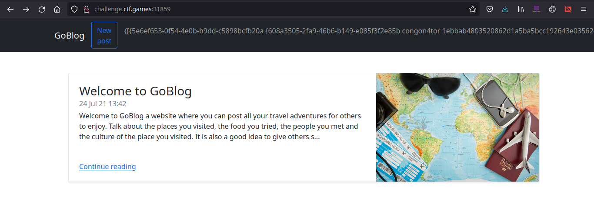

After doing some research, apparently we could call the method in template.

My another wild thought it we need to guess method name to creating a new valid cookies. But it was failed.

Untill I realized that we actually have a snippet source code. 

After doing some static analysis, in the `profile.html.tmpl`, it call `{{.CurrentUser.Username}}`. 

So, I assume in tthis application the `.CurrentUser` is struct in models from `users.go`

I am trying to change my account password using `{{.CurrentUser.ChangePassword "x"}}` and then visit `/profile` 

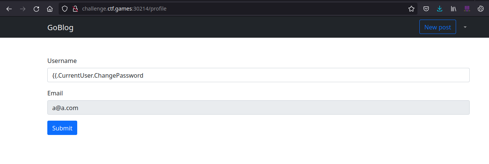

My account password is changed.

But, how we can change admin password while the method only change our current user?

In the `post.html.tmpl` we could see, golang templating a `{{.Post.Author.Username}}`

I guess, it was a nested struct, and `.Author` bearing a `users.go` model

I set my username to this `{{.Post.Author.ChangePassword "nyx"}}` and then visit article created by admin `/post/5e6ef653-0f54-4e0b-b9dd-c5898bcfb20a` 

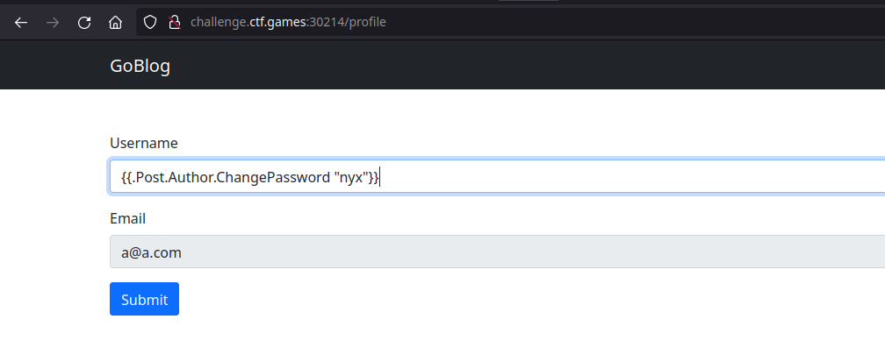

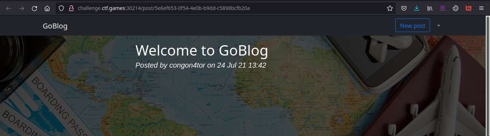

Our response were'nt giving any errors. I assume we success changing the account.

Since, we got admin email from `{{.}}` let's give a shot trying login with email as `congo@congon4tor.com` and the password is `nyx`

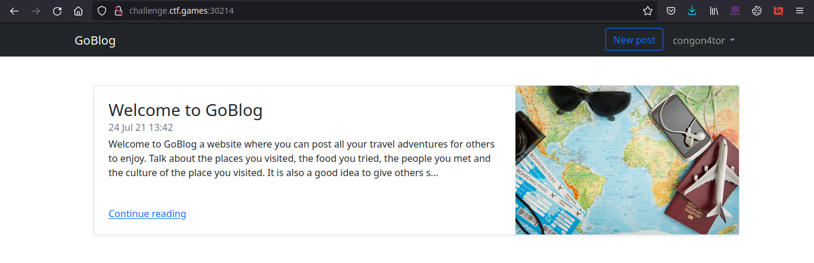

Cool! we successful login as admin

now visit `/admin` to get the FLAG

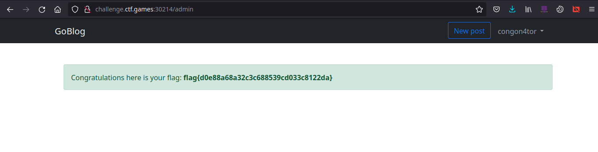
